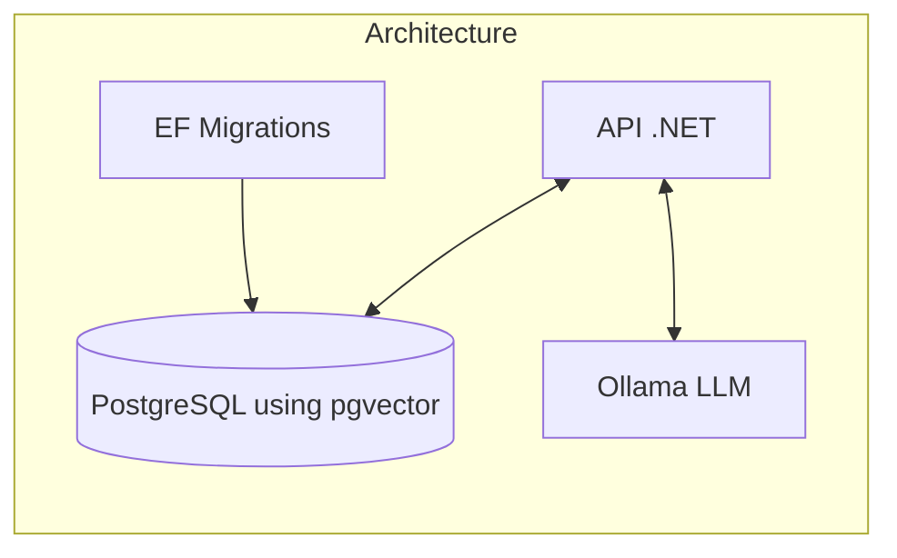

# Architecture



# API Endpoints

| Method | Endpoint         | Description                        |
|--------|------------------|------------------------------------|
| GET    | /text            | List first 20 texts                 |
| POST   | /text            | Add texts (array of { content })    |
| GET    | /text/search     | Vector search (?query=...)          |

## Testing the API

You can use the provided [.http](`Api/Api.http`) file to easily test the API endpoints directly from Visual Studio Code or other compatible tools. This file contains example requests for adding, searching, and listing texts.
# EmbeddingPoC

A proof-of-concept .NET API for text embedding and semantic search using PostgreSQL with pgvector and Ollama for embedding generation.

## Features

- Store and retrieve text embeddings in PostgreSQL using Entity Framework Core and pgvector.
- Generate embeddings via Ollama API.
- REST endpoints for:
  - Adding new texts and their embeddings.
  - Searching for similar texts using vector similarity.
  - Listing stored texts.

## Usage

Simply run:

```
docker-compose up --build
```

This will automatically:
- Build and start the API and PostgreSQL database
- Run database migrations
- Install the LLM model to Ollama
- Launch the application, ready to use
